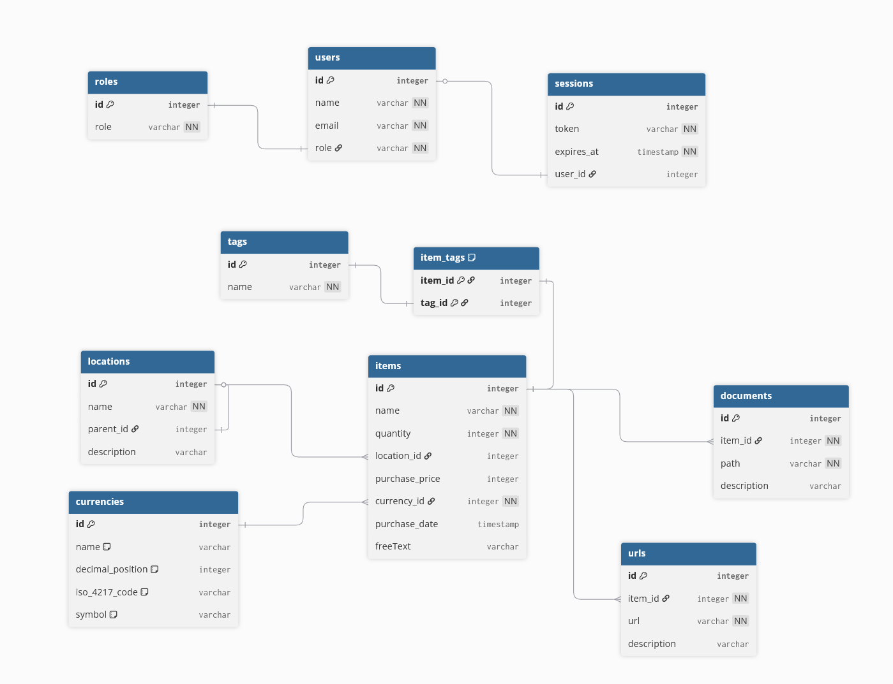

# inventory_system

A project created to help manage the inventory system of private people. The project is not intended for industrial use as it is deliberately developed for non-business users. The project is built with Node.js and manages an SQL database running on an Express.js server.

> :warning: **Warning:** The project contains a Bash script. Therefore, the user might run into problems during database migration if bash is not installed

- What tools is this project built with?
- Overall structure of the app
- Installation

## What tools is this project built with?

The project is built with Node.js. The project itself is an Express app connected to an SQL database. The app has full CRUD capabilities for multiple routes. The sqlite Node.js module is used to for the database system of the Express app.

## Overall structure of the app

The latest version of the database looks as illustrated in the diagram below. The structure of the database can be customised via a database-design.dbml file inside of the dbdiagram.io folder. This design so far has made sense for our personal usecase.

## Installation

As the project is not published anywhere else but on GitHub, interested users have to clone this project onto their local machines as they normally would.

## How to run the app

The app comes with various pre-made NPM commands.

The following command does a full database migration of all existing migration files:
`npm run migrate-all`

However, it is also possible to only update up until a certain date, for example:
`npm utils/migration.sh yyyy-mm-dd`

However, beware that the date specific migration command requires that bash is installed on the users computer.
